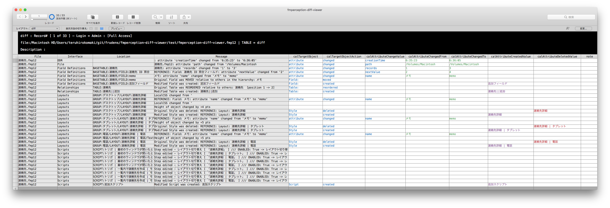

# fmperception-diff-viewer

- FMPerceptionのdiffを見やすくするためのファイルです。
- FMPerceptionからCSVファイルをエクスポートして、CSVファイルをインポートするだけです。
- 将来的にdiffのデフォルトがBaseElementsのように見やすくなることを期待しています。
- 一時的なツールとして作成しました。
- ご自由に使ってください。
- お気づきな点があれば、是非ともご指摘頂ければと思います。

