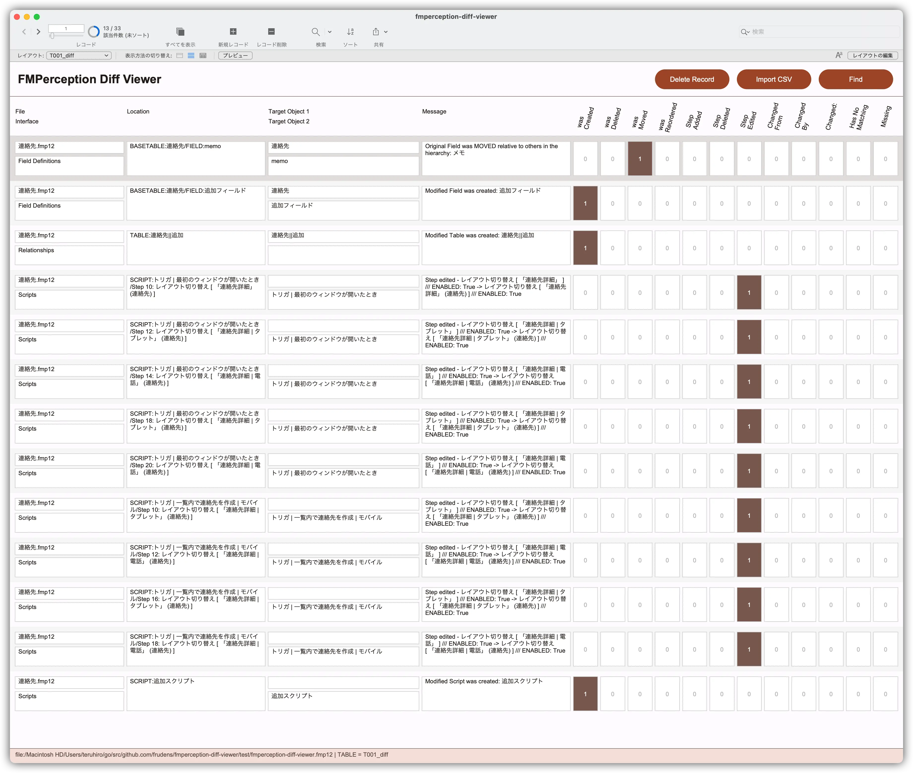
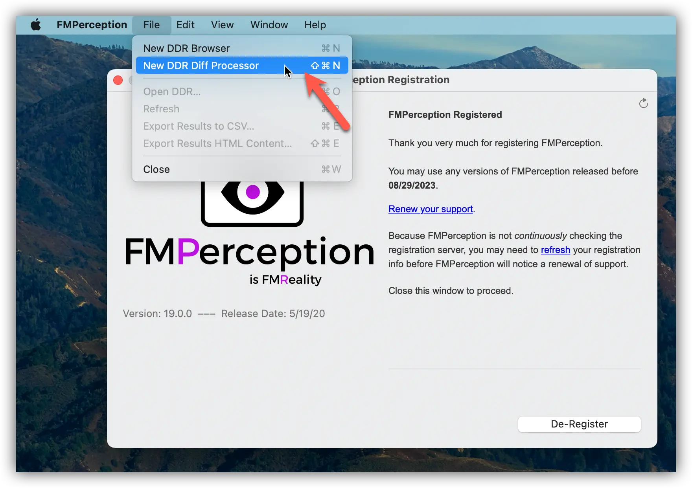
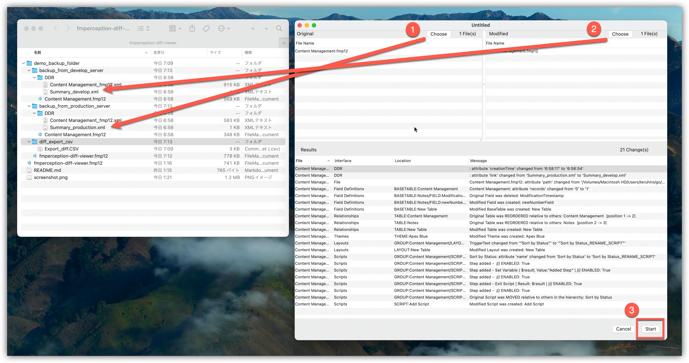
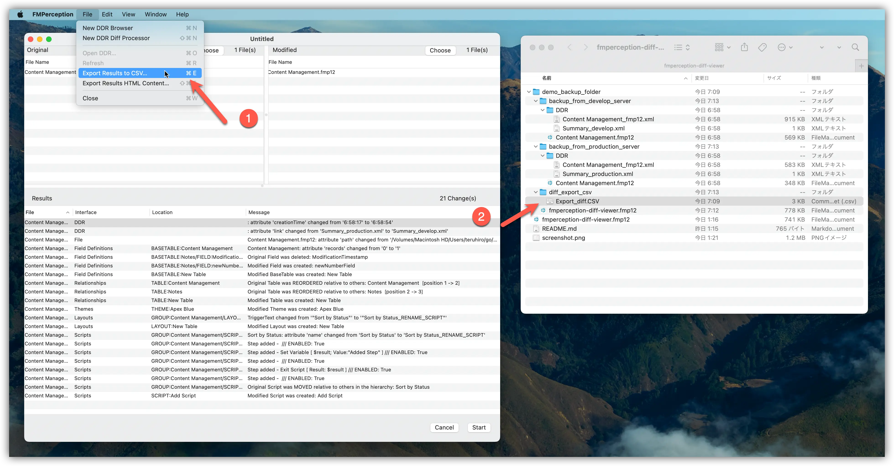
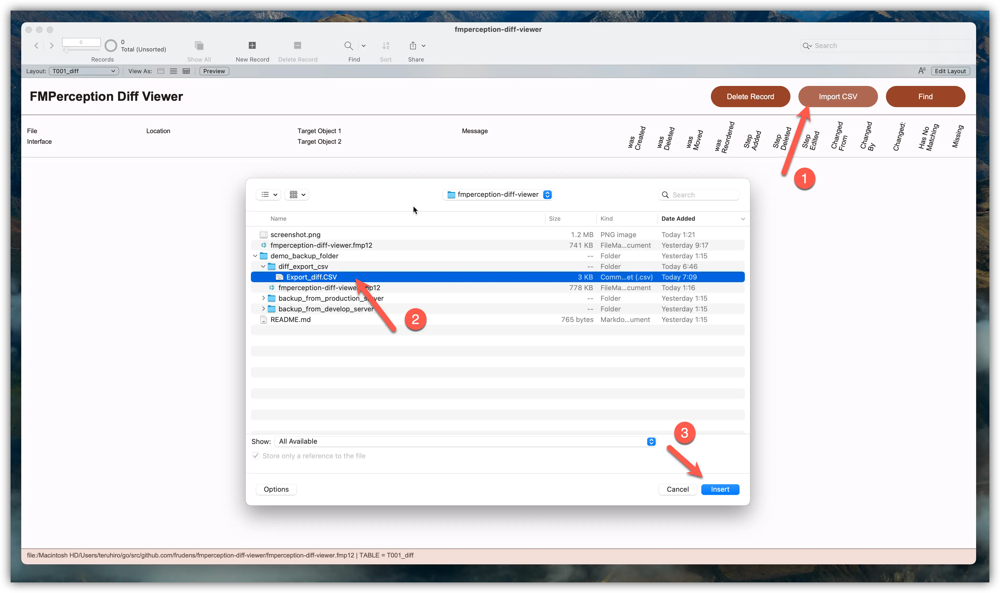
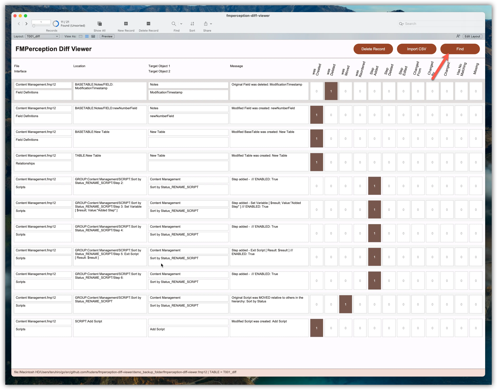

# About fmperception-diff-viewer

## Description

- It is a simple tool for viewing the result of executing "Diff Processor" of FMPerception with FileMaker.

## ScreenShot

## Download

- Clone the repository or download it from the [Release page](https://github.com/frudens/fmperception-diff-viewer/releases).

## How to Use

### Step 1

1. Start FMPerception. Select "New DDR Diff Processor" from the menu.

### Step 2

1. In the "Original" pane on the left, select the production DDR.
2. In the "Modified" pane on the right, select the development DDR.
3. Select "Start".

### Step 3

1. Select "Export Results to CSV..." from the menu.
2. Select any location and export.

### Step 4

1. Launch "fmperception-diff-viewer.fmp12" and select "Import CSV".
2. Select the CSV file you exported earlier.

### Step 5

1. Select "Find".

## Movie(Old Version)

* [How to Use "fmperception-diff-viewer"](https://youtu.be/eyfsoSQD7eQ)

## Author

- Teruhiro Komaki @frudens
